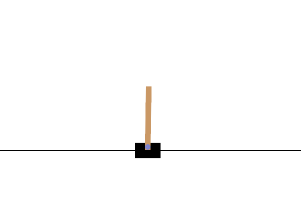
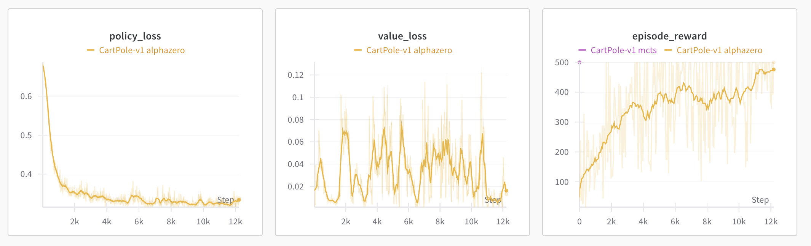

# A Tutorial to train Alpha Zero on CartPole-v1

Code to train different agents, including AlphaZero, on the CartPole-v1 environment.

<div align="center">
  
</div>



## Install

```
sudo apt update
sudo apt install swig
```

```
pip install -r requirements.txt
```


## Examples on cartpole-v1

### Random agent:

A random agent that choses action 0 or 1 randomly at each step. Expect poor performance, an average reward of 24 per episode (out of 500 maximum).

```
python train.py config/random_cartpole-v1.yaml
```

```
wandb: Run summary:
wandb:    episode_reward 24
wandb:    moving_average 21.97
wandb: steps_per_episode 24
```

### Best First Search agent

A heuristic-driven approach that uses a priority queue to explore states, prioritizing those with the lowest cost (e.g., minimizing pole angle and angular velocity in CartPole). This ensures the most promising paths are evaluated first for efficient exploration.

```
python train.py config/bfs_cartpole-v1.yaml
```

### Monte Carlo Tree Search:

MCTS uses a tree structure where nodes represent states and edges represent actions. It iteratively explores the tree by selecting actions that balance exploration and exploitation (using UCB scores), simulating random rollouts from leaf nodes, and backpropagating the resulting rewards to refine statistics, enabling the selection of the most promising action for the next step..

```
python train.py config/mcts_cartpole-v1.yaml
```

```
wandb: Run summary:
wandb:    episode_reward 500
wandb:    moving_average 500
wandb: steps_per_episode 500
```

### AlphaZero:

AlphaZero-inspired agent combining MCTS and neural networks. This implementation combines Monte Carlo Tree Search (MCTS) with neural networks for policy and value estimation, enabling the agent to efficiently search and learn in complex state spaces. The neural network guides the search by predicting policy probabilities and state values. This approach needs to train a policy and a value network and progressively during training. It collects data during `PLAY`, then goes on `TRAIN` mode. The training takes 2h in an RTX4090 (can probably be optimized).

```
python train.py config/mcts_alphazero_cartpole-v1.yaml
```


```
INFO:logger:PLAY: Episode 1/250: Reward: 34.0
INFO:logger:PLAY: Episode 2/250: Reward: 76.0
INFO:logger:PLAY: Episode 3/250: Reward: 126.0
INFO:logger:TRAIN: Episode 3/250: Reward: 126.0 loss_v: 0.01407 loss_p: 0.68694
...
INFO:logger:PLAY: Episode 250/250: Reward: 500.0
INFO:logger:TRAIN: Episode 250/250: Reward: 500.0 loss_v: 0.02220 loss_p: 0.32521
INFO:logger:TRAIN: Episode 250/250: Reward: 500.0 loss_v: 0.01789 loss_p: 0.32570
INFO:logger:TRAIN: Episode 250/250: Reward: 500.0 loss_v: 0.01721 loss_p: 0.31841
INFO:logger:TRAIN: Episode 250/250: Reward: 500.0 loss_v: 0.01564 loss_p: 0.32983
INFO:logger:TRAIN: Episode 250/250: Reward: 500.0 loss_v: 0.01414 loss_p: 0.32775
INFO:logger:TRAIN: Episode 250/250: Reward: 500.0 loss_v: 0.01322 loss_p: 0.34173
INFO:logger:TRAIN: Episode 250/250: Reward: 500.0 loss_v: 0.01298 loss_p: 0.33783
```

## Resources

https://medium.com/@_michelangelo_/alphazero-for-dummies-5bcc713fc9c6


